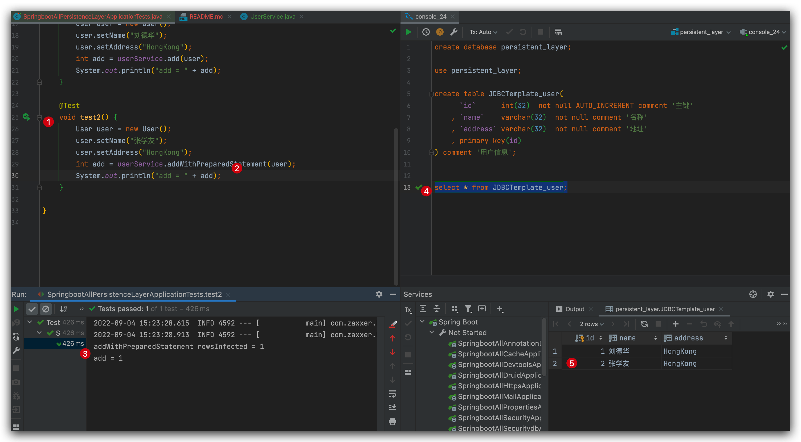

<h1>本项目介绍Springboot整合持久层.</h1>
## Spring JDBC
### 新项目pom.xml

```xml
<?xml version="1.0" encoding="UTF-8"?>
<project xmlns="http://maven.apache.org/POM/4.0.0" xmlns:xsi="http://www.w3.org/2001/XMLSchema-instance"
         xsi:schemaLocation="http://maven.apache.org/POM/4.0.0 https://maven.apache.org/xsd/maven-4.0.0.xsd">
    <modelVersion>4.0.0</modelVersion>
    <groupId>com.boy</groupId>
    <artifactId>springboot-all-Persistence-Layer</artifactId>
    <version>0.0.1-SNAPSHOT</version>
    <name>springboot-all-Persistence-Layer</name>
    <description>springboot-all-Persistence-Layer</description>

    <properties>
        <java.version>1.8</java.version>
        <project.build.sourceEncoding>UTF-8</project.build.sourceEncoding>
        <project.reporting.outputEncoding>UTF-8</project.reporting.outputEncoding>
        <spring-boot.version>2.3.7.RELEASE</spring-boot.version>
    </properties>

    <dependencies>
        <dependency>
            <groupId>org.springframework.boot</groupId>
            <artifactId>spring-boot-starter-jdbc</artifactId>
        </dependency>
        <dependency>
            <groupId>org.springframework.boot</groupId>
            <artifactId>spring-boot-starter-web</artifactId>
        </dependency>
        <dependency>
            <groupId>org.projectlombok</groupId>
            <artifactId>lombok</artifactId>
        </dependency>

        <dependency>
            <groupId>mysql</groupId>
            <artifactId>mysql-connector-java</artifactId>
            <scope>runtime</scope>
        </dependency>
        <dependency>
            <groupId>org.springframework.boot</groupId>
            <artifactId>spring-boot-starter-test</artifactId>
            <scope>test</scope>
            <exclusions>
                <exclusion>
                    <groupId>org.junit.vintage</groupId>
                    <artifactId>junit-vintage-engine</artifactId>
                </exclusion>
            </exclusions>
        </dependency>
    </dependencies>

    <dependencyManagement>
        <dependencies>
            <dependency>
                <groupId>org.springframework.boot</groupId>
                <artifactId>spring-boot-dependencies</artifactId>
                <version>${spring-boot.version}</version>
                <type>pom</type>
                <scope>import</scope>
            </dependency>
        </dependencies>
    </dependencyManagement>

    <build>
        <plugins>
            <plugin>
                <groupId>org.apache.maven.plugins</groupId>
                <artifactId>maven-compiler-plugin</artifactId>
                <version>3.8.1</version>
                <configuration>
                    <source>1.8</source>
                    <target>1.8</target>
                    <encoding>UTF-8</encoding>
                </configuration>
            </plugin>
            <plugin>
                <groupId>org.springframework.boot</groupId>
                <artifactId>spring-boot-maven-plugin</artifactId>
                <version>2.3.7.RELEASE</version>
                <configuration>
                    <mainClass>com.boy.springbootallpersistencelayer.SpringbootAllPersistenceLayerApplication
                    </mainClass>
                </configuration>
                <executions>
                    <execution>
                        <id>repackage</id>
                        <goals>
                            <goal>repackage</goal>
                        </goals>
                    </execution>
                </executions>
            </plugin>
        </plugins>
    </build>

</project>
```

### yml
```yaml
spring:
  application:
    name: springboot-all-Persistence-Layer
  datasource:
    name: defaultDataSource
    driver-class-name: com.mysql.cj.jdbc.Driver
    url: jdbc:mysql://localhost:3306/persistent_layer?serverTimezone=UTC&useUnicode=true&characterEncoding=utf-8&zeroDateTimeBehavior=convertToNull
    username: root
    password: MyNewPassword
```

### entity
```java
package com.boy.springbootallpersistencelayer.entity;

import lombok.AllArgsConstructor;
import lombok.Data;
import lombok.NoArgsConstructor;
import lombok.ToString;

/**
 * @author Joshua.H.Brooks
 * @description
 */
@Data
@ToString
@NoArgsConstructor
@AllArgsConstructor
public class User {
    private Integer id;
    private String name;
    private String address;
}
```

### Service
```java
package com.boy.springbootallpersistencelayer.service;

import com.boy.springbootallpersistencelayer.entity.User;
import org.springframework.beans.factory.annotation.Autowired;
import org.springframework.jdbc.core.JdbcTemplate;
import org.springframework.stereotype.Service;

/**
 * @author Joshua.H.Brooks
 * @description
 * @date 2022-09-04 14:55
 */
@Service
public class UserService {
    @Autowired
    JdbcTemplate jdbcTemplate;

    public int add(User user){ 
        //增删改都是用jdbcTemplate.update方法
        int rowsInfected = jdbcTemplate.update("insert into JDBCTemplate_user (`name`,`address`) values (?,?)", user.getName(), user.getAddress());
        System.out.println("rowsInfected = " + rowsInfected);
        return rowsInfected;
    }
}
```

### DB数据库表准备
建库建表
```sql
create database persistent_layer;
use persistent_layer;
create table JDBCTemplate_user(
      `id`      int(32)  not null AUTO_INCREMENT comment '主键'
    , `name`    varchar(32)  not null comment '名称'
    , `address` varchar(32)  not null comment '地址'
    , primary key(id)
) comment '用户信息';
```

### 测试
```java
package com.boy.springbootallpersistencelayer;

import com.boy.springbootallpersistencelayer.entity.User;
import com.boy.springbootallpersistencelayer.service.UserService;
import org.junit.jupiter.api.Test;
import org.springframework.beans.factory.annotation.Autowired;
import org.springframework.boot.test.context.SpringBootTest;

@SpringBootTest
class SpringbootAllPersistenceLayerApplicationTests {

    @Autowired
    UserService userService;
    
    @Test
    void contextLoads() {
        User user = new User();
        user.setName("刘德华");
        user.setAddress("HongKong");
        int add = userService.add(user);
        System.out.println("add = " + add);
    }

}
```

### 结果查看

### 使用JDBC和PreparedStatementCreator
```java
  public int addWithPreparedStatement(User user) {
        GeneratedKeyHolder keyHolder = new GeneratedKeyHolder();
        //增删改都是用jdbcTemplate.update方法
        int rowsInfected = jdbcTemplate.update(new PreparedStatementCreator() {
            @Override
            public PreparedStatement createPreparedStatement(Connection connection) throws SQLException {
                PreparedStatement ps = connection.prepareStatement("insert into JDBCTemplate_user (`name`,`address`) values (?,?)", Statement.RETURN_GENERATED_KEYS);
                ps.setString(1, user.getName());
                ps.setString(2, user.getAddress());
                return ps;
            }
        }, keyHolder);
        user.setId(keyHolder.getKey().intValue()); //主键回填
        System.out.println("addWithPreparedStatement rowsInfected = " + rowsInfected);
        return rowsInfected;
    }
```
### 测试
```java
 @Test
void test2() {
    User user = new User();
    user.setName("张学友");
    user.setAddress("HongKong");
    int add = userService.addWithPreparedStatement(user);
    System.out.println("add = " + add);
}
```
### 查看结果


### 对于其他删,改,查的逻辑实现
```java
package com.boy.springbootallpersistencelayer.service;

import com.boy.springbootallpersistencelayer.entity.User;
import org.springframework.beans.factory.annotation.Autowired;
import org.springframework.jdbc.core.BeanPropertyRowMapper;
import org.springframework.jdbc.core.JdbcTemplate;
import org.springframework.jdbc.core.PreparedStatementCreator;
import org.springframework.jdbc.core.RowMapper;
import org.springframework.jdbc.support.GeneratedKeyHolder;
import org.springframework.stereotype.Service;

import java.sql.*;
import java.util.List;

/**
 * @author Joshua.H.Brooks
 * @description
 * @date 2022-09-04 14:55
 */
@Service
public class UserService {
    @Autowired
    JdbcTemplate jdbcTemplate;

    public int add(User user) {
        //增删改都是用jdbcTemplate.update方法
        int rowsInfected = jdbcTemplate.update("insert into JDBCTemplate_user (`name`,`address`) values (?,?)", user.getName(), user.getAddress());
        System.out.println("rowsInfected = " + rowsInfected);
        return rowsInfected;
    }

    public int addWithPreparedStatement(User user) {
        GeneratedKeyHolder keyHolder = new GeneratedKeyHolder();
        //增删改都是用jdbcTemplate.update方法
        int rowsInfected = jdbcTemplate.update(new PreparedStatementCreator() {
            @Override
            public PreparedStatement createPreparedStatement(Connection connection) throws SQLException {
                PreparedStatement ps = connection.prepareStatement("insert into JDBCTemplate_user (`name`,`address`) values (?,?)", Statement.RETURN_GENERATED_KEYS);
                ps.setString(1, user.getName());
                ps.setString(2, user.getAddress());
                return ps;
            }
        }, keyHolder);
        user.setId(keyHolder.getKey().intValue()); //主键回填
        System.out.println("addWithPreparedStatement rowsInfected = " + rowsInfected);
        return rowsInfected;
    }

    public int updateById(String name,Integer id) {
        int rowsAffected = jdbcTemplate.update("update JDBCTemplate_user set `name` = ? where `id` = ?", name, id);
        return  rowsAffected;
    }

    public int deleteById(String id) {
        int rowsAffected = jdbcTemplate.update("delete from JDBCTemplate_user where `id` = ?",  id);
        return  rowsAffected;
    }


    public List<User> getAll() {
        //第二个参数是RowMapper匿名方法的lambda表达式
        List<User> list = jdbcTemplate.query("select * from JDBCTemplate_user ", (resultSet, i) -> new User(resultSet.getInt("id"), resultSet.getString("name"), resultSet.getString("address")));
        return  list;
    }

    public List<User> getAll2() {
        //new BeanPropertyRowMapper(class) 这种方式必须保证返回对象属性和表字段一一匹配
        List<User> list = jdbcTemplate.query("select * from JDBCTemplate_user ", new BeanPropertyRowMapper<>(User.class));
        return  list;
    }
}
```

### 删改查测试及结果查看


## Spring JDBC-实现多数据源
### 修改Yml
首先需要修改yml文件, 因为原本默认的配置在多数据源情况下不再生效了.
```yaml
spring:
  application:
    name: springboot-all-Persistence-Layer
  datasource:
    one:
      name: defaultDataSource
      driver-class-name: com.mysql.cj.jdbc.Driver
      jdbcUrl: jdbc:mysql://localhost:3306/persistent_layer?serverTimezone=UTC&useUnicode=true&characterEncoding=utf-8&zeroDateTimeBehavior=convertToNull
      username: root
      password: MyNewPassword
    two:
      name: defaultDataSource
      driver-class-name: com.mysql.cj.jdbc.Driver
      jdbcUrl: jdbc:mysql://localhost:3306/persistent_layer_2?serverTimezone=UTC&useUnicode=true&characterEncoding=utf-8&zeroDateTimeBehavior=convertToNull
      username: root
      password: MyNewPassword
```
有一点要注意的是, 默认使用的数据源是`HikariDataSource`, 属性url要改成`jdbcUrl`.
否则会报错:


### 注入多数据源
```java
package com.boy.springbootallpersistencelayer.config;

import com.zaxxer.hikari.HikariDataSource;
import org.springframework.boot.context.properties.ConfigurationProperties;
import org.springframework.context.annotation.Bean;
import org.springframework.context.annotation.Configuration;

import javax.sql.DataSource;

/**
 * @author Joshua.H.Brooks
 * @description
 * @date 2022-09-04 16:03
 */
@Configuration
public class MultiDataSourceConfig {
    @Bean
    @ConfigurationProperties(prefix = "spring.datasource.one")
    DataSource dsOne() {
        return new HikariDataSource();
    }

    @Bean
    @ConfigurationProperties(prefix = "spring.datasource.two")
    DataSource dsTwo() {
        return new HikariDataSource();
    }
}
```
### JDBCTemplate关联数据源
```java
package com.boy.springbootallpersistencelayer.config;

import org.springframework.beans.factory.annotation.Qualifier;
import org.springframework.context.annotation.Bean;
import org.springframework.context.annotation.Configuration;
import org.springframework.jdbc.core.JdbcTemplate;

import javax.sql.DataSource;

/**
 * @author Joshua.H.Brooks
 * @description
 * @date 2022-09-04 16:08
 */
@Configuration
public class JdbcTemplateConfig {
    @Bean
    JdbcTemplate jdbcTemplateOne(@Qualifier("dsOne") DataSource dataSource){
        return new JdbcTemplate(dataSource);
    }

    @Bean
    JdbcTemplate jdbcTemplateTwo(@Qualifier("dsTwo") DataSource dataSource){
        return new JdbcTemplate(dataSource);
    }
}
```
### 修改service
```java
@Service
public class UserService {
//    @Autowired
//    JdbcTemplate jdbcTemplate;

    @Autowired
    JdbcTemplate jdbcTemplateOne;
    @Autowired
    JdbcTemplate jdbcTemplateTwo;

    public int addMultiDatasource(User user) {
        //增删改都是用jdbcTemplate.update方法
        int rowsInfectedOne = jdbcTemplateOne.update("insert into JDBCTemplate_user (`name`,`address`) values (?,?)", user.getName(), user.getAddress());
        int rowsInfectedTwo = jdbcTemplateTwo.update("insert into JDBCTemplate_user_2 (`name`,`address`) values (?,?)", user.getName(), user.getAddress());
        System.out.println("rowsInfectedOne = " + rowsInfectedOne);
        System.out.println("rowsInfectedTwo = " + rowsInfectedTwo);
        return rowsInfectedOne + rowsInfectedTwo;
    }
}
```
注意, 因为原来的默认配置不再生效, 所以注释带掉. 而是改为注入jdbcTemplateOne和jdbcTemplateTwo了.
### 测试
```java
package com.boy.springbootallpersistencelayer;

import com.boy.springbootallpersistencelayer.entity.User;
import com.boy.springbootallpersistencelayer.service.UserService;
import org.junit.jupiter.api.Test;
import org.springframework.beans.factory.annotation.Autowired;
import org.springframework.boot.test.context.SpringBootTest;

@SpringBootTest
class SpringbootAllPersistenceLayerApplicationTests {

    @Autowired
    UserService userService;

    @Test
    void test() {
        User user = new User();
        user.setName("Brad Pitt");
        user.setAddress("US");
        int add = userService.addMultiDatasource(user);
        System.out.println("add = " + add);
    }
}
```
### 结果查看
确实两个库的表都有新插入的数据.


