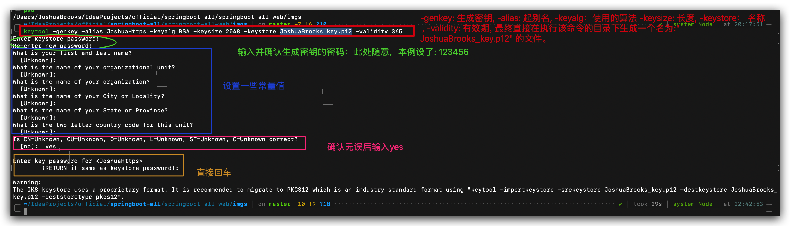
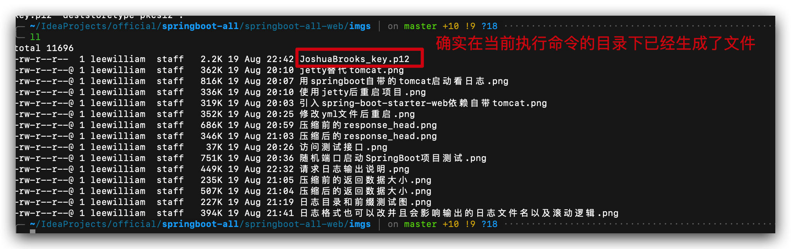
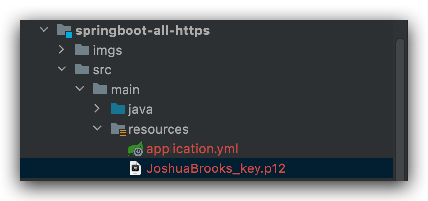
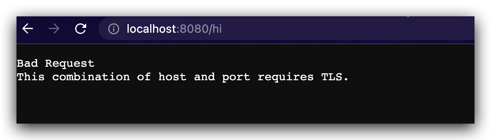
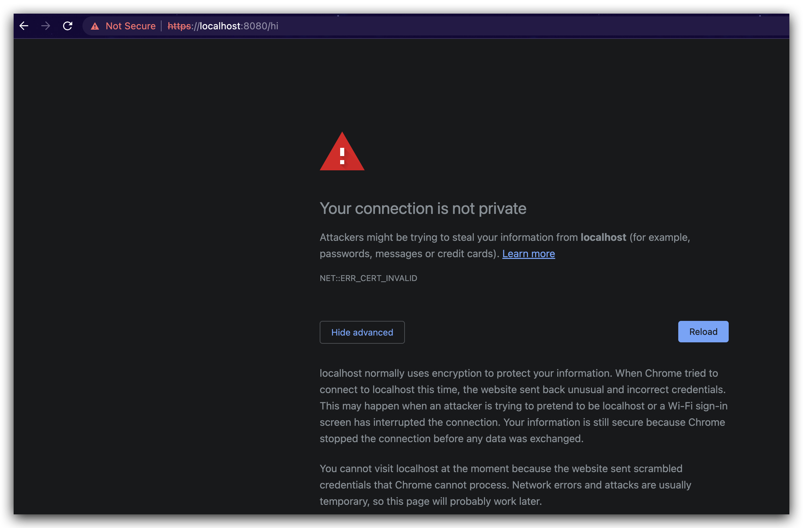
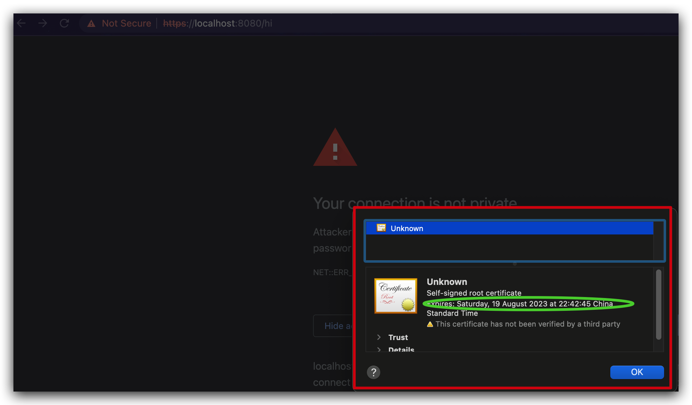

1. 生成密钥:


2. 拷贝密钥到当前项目的resource下

3. 配置yml
```yaml
# 应用名称
spring:
  application:
    name: springboot-all-https
#假设生成的命令command是 keytool -genkey -alias JoshuaHttps -keyalg RSA -keysize 2048 -keystore JoshuaBrooks_key.p12 -validity 365
server:
  ssl:
    key-alias: JoshuaHttps #就是刚才生成过程中指定的别名
    key-store: classpath:JoshuaBrooks_key.p12
    key-store-password: 123456 #就是执行command后提示Enter keystore password: 输入的密码
```
4. 新建controller测试访问接口
```java
package com.boy.springbootallhttps.controller;

import org.springframework.web.bind.annotation.GetMapping;
import org.springframework.web.bind.annotation.RestController;

/**
 * @author Joshua.H.Brooks
 * @description
 * @date 2022-08-19 23:01
 */
@RestController
public class HiController {
    @GetMapping("/hi")
    public String hi(){
        return "Hi";
    }
}
```
启动项目后分别使用http和https请求接口, 查看返回




加上转发配置
将所有8080端口http访问转发到8081的https访问
```java
package com.boy.springbootallhttps.config;

import org.apache.catalina.Context;
import org.apache.catalina.connector.Connector;
import org.apache.tomcat.util.descriptor.web.SecurityCollection;
import org.apache.tomcat.util.descriptor.web.SecurityConstraint;
import org.springframework.boot.web.embedded.tomcat.TomcatServletWebServerFactory;
import org.springframework.context.annotation.Bean;
import org.springframework.context.annotation.Configuration;

/**
 * @author Joshua.H.Brooks
 * @description
 * @date 2022-08-19 23:14
 */
@Configuration
public class TomcatConfig {
    @Bean
    TomcatServletWebServerFactory tomcatServletWebServerFactory() {
        TomcatServletWebServerFactory tomcatServletWebServerFactory = new TomcatServletWebServerFactory() {
            @Override
            protected void postProcessContext(Context context) {
                SecurityConstraint securityConstraint = new SecurityConstraint();
                securityConstraint.setUserConstraint("CONFIDENTIAL");
                SecurityCollection securityCollection = new SecurityCollection();
                securityCollection.addPattern("/*");
                securityConstraint.addCollection(securityCollection);
                context.addConstraint(securityConstraint);
            }
        };
        tomcatServletWebServerFactory.addAdditionalTomcatConnectors(myConnectors());
        return tomcatServletWebServerFactory;
    }


    private Connector myConnectors() {
        Connector connector = new Connector("org.apache.coyote.http11.Http11Nio2Protocol");
        connector.setScheme("http");
        connector.setPort(8081);
        connector.setSecure(false);
        connector.setRedirectPort(8080);
        return connector;

    }
}
```
重启项目, 当在浏览器输入`http://localhost:8081/hi`进行访问时, 会自动重定向到`https://localhost:8080/hi`
