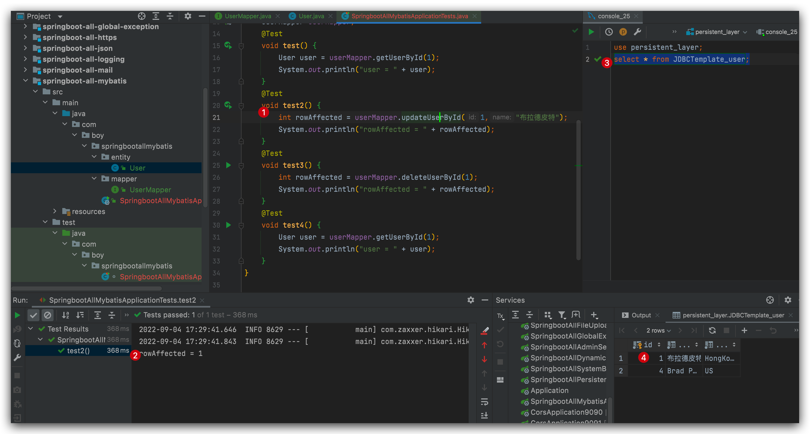

<h1>Spring Boot整合MyBatis</h1>

## 整合MyBatis

### 新项目 pom.xml

```xml
<?xml version="1.0" encoding="UTF-8"?>
<project xmlns="http://maven.apache.org/POM/4.0.0" xmlns:xsi="http://www.w3.org/2001/XMLSchema-instance"
         xsi:schemaLocation="http://maven.apache.org/POM/4.0.0 https://maven.apache.org/xsd/maven-4.0.0.xsd">
    <modelVersion>4.0.0</modelVersion>
    <groupId>com.boy</groupId>
    <artifactId>springboot-all-mybatis</artifactId>
    <version>0.0.1-SNAPSHOT</version>
    <name>springboot-all-mybatis</name>
    <description>springboot-all-mybatis</description>

    <properties>
        <java.version>1.8</java.version>
        <project.build.sourceEncoding>UTF-8</project.build.sourceEncoding>
        <project.reporting.outputEncoding>UTF-8</project.reporting.outputEncoding>
        <spring-boot.version>2.3.7.RELEASE</spring-boot.version>
    </properties>

    <dependencies>
        <dependency>
            <groupId>org.springframework.boot</groupId>
            <artifactId>spring-boot-starter-jdbc</artifactId>
        </dependency>
        <dependency>
            <groupId>org.springframework.boot</groupId>
            <artifactId>spring-boot-starter-web</artifactId>
        </dependency>
        <dependency>
            <groupId>org.projectlombok</groupId>
            <artifactId>lombok</artifactId>
        </dependency>
        <dependency>
            <groupId>org.mybatis.spring.boot</groupId>
            <artifactId>mybatis-spring-boot-starter</artifactId>
            <version>2.1.3</version>
        </dependency>

        <dependency>
            <groupId>mysql</groupId>
            <artifactId>mysql-connector-java</artifactId>
            <scope>runtime</scope>
        </dependency>
        <dependency>
            <groupId>org.springframework.boot</groupId>
            <artifactId>spring-boot-starter-test</artifactId>
            <scope>test</scope>
            <exclusions>
                <exclusion>
                    <groupId>org.junit.vintage</groupId>
                    <artifactId>junit-vintage-engine</artifactId>
                </exclusion>
            </exclusions>
        </dependency>
    </dependencies>

    <dependencyManagement>
        <dependencies>
            <dependency>
                <groupId>org.springframework.boot</groupId>
                <artifactId>spring-boot-dependencies</artifactId>
                <version>${spring-boot.version}</version>
                <type>pom</type>
                <scope>import</scope>
            </dependency>
        </dependencies>
    </dependencyManagement>

    <build>
        <plugins>
            <plugin>
                <groupId>org.apache.maven.plugins</groupId>
                <artifactId>maven-compiler-plugin</artifactId>
                <version>3.8.1</version>
                <configuration>
                    <source>1.8</source>
                    <target>1.8</target>
                    <encoding>UTF-8</encoding>
                </configuration>
            </plugin>
            <plugin>
                <groupId>org.springframework.boot</groupId>
                <artifactId>spring-boot-maven-plugin</artifactId>
                <version>2.3.7.RELEASE</version>
                <configuration>
                    <mainClass>com.boy.springbootallmybatis.SpringbootAllMybatisApplication</mainClass>
                </configuration>
                <executions>
                    <execution>
                        <id>repackage</id>
                        <goals>
                            <goal>repackage</goal>
                        </goals>
                    </execution>
                </executions>
            </plugin>
        </plugins>
    </build>
</project>
```

### yml

```yaml
# 应用名称
spring:
  application:
    name: springboot-all-mybatis
  datasource:
    name: defaultDataSource
    driver-class-name: com.mysql.cj.jdbc.Driver
    url: jdbc:mysql://localhost:3306/persistent_layer?serverTimezone=UTC&useUnicode=true&characterEncoding=utf-8&zeroDateTimeBehavior=convertToNull
    username: root
    password: MyNewPassword
```
### entity.User类

```java
package com.boy.springbootallmybatis.entity;

import lombok.AllArgsConstructor;
import lombok.Data;
import lombok.NoArgsConstructor;
import lombok.ToString;

/**
 * @author Joshua.H.Brooks
 * @description
 * @date 2022-09-04 16:58
 */
@Data
@ToString
@NoArgsConstructor
@AllArgsConstructor
public class User {
    private Integer id;
    private String name;
    private String address;
}
```

### UserMapper
```java
package com.boy.springbootallmybatis.mapper;


import com.boy.springbootallmybatis.entity.User;
import org.apache.ibatis.annotations.Select;

/**
 * @author Joshua.H.Brooks
 * @description
 * @date 2022-09-04 16:52
 */
public interface UserMapper {
    @Select("select * from JDBCTemplate_user where id=#{id}")
    User getUserById(Integer id);
}
```
注意⚠️: 要么在每个Mapper接口上添加@Mapper注解, 要么在启动类上添加@MapperScan(basePackages = {"com.boy.springbootallmybatis.mapper"}).

### 测试
```java
package com.boy.springbootallmybatis;

import com.boy.springbootallmybatis.mapper.UserMapper;
import com.boy.springbootallmybatis.entity.User;
import org.junit.jupiter.api.Test;
import org.springframework.beans.factory.annotation.Autowired;
import org.springframework.boot.test.context.SpringBootTest;

@SpringBootTest
class SpringbootAllMybatisApplicationTests {

    @Autowired
    UserMapper userMapper;
    @Test
    void test() {
        User user = userMapper.getUserById(1);
        System.out.println("user = " + user);
    }
}
```
### 结果查看


### 其他方法的实现
```java
package com.boy.springbootallmybatis.mapper;


import com.boy.springbootallmybatis.entity.User;
import org.apache.ibatis.annotations.*;

/**
 * @author Joshua.H.Brooks
 * @description
 * @date 2022-09-04 16:52
 */
public interface UserMapper {
    @Select("select * from JDBCTemplate_user where id=#{id}")
    User getUserById(Integer id);

    @Update("update JDBCTemplate_user set `name` = #{name} where id=#{id}")
    int updateUserById(@Param("id") Integer id,@Param("name") String name);

    @Delete("delete from JDBCTemplate_user where id=#{id}")
    int deleteUserById(@Param("id") Integer id);

    @Insert("insert into JDBCTemplate_user (`name`,`address`) values (#{name}, #{address}) ")
    @SelectKey(statement = "select last_insert_id()",keyProperty = "id", before = false, resultType = Integer.class) //主键回填
    int insert(User user);
}
```
注意⚠️: 版本不同, 可能有些版本不需要@Param注解(但是需要表字段和类属性名称一致), 有些一定要, 否则会报错.

### 测试结果查看
 
 
 

## XML方式整合MyBatis
### Tips: 建mapper模版
idea设置/偏好界面找到File and Code Template 添加xml模版,并命名,例如:mapper. 模板具体内容如下
以后再建mapper就不需要再从其他地方拷贝头.
```xml
<!DOCTYPE mapper PUBLIC "-//mybatis.org//DTD Mapper 3.0//EN" "http://mybatis.org/dtd/mybatis-3-mapper.dtd">
<mapper namespace="#[[$namespace$]]#">

</mapper>
```

### 建UserMapper.xml
在resources下新建mapper目录, 然后在里面添加UserMapper.xml文件,如下:
```xml
<!DOCTYPE mapper PUBLIC "-//mybatis.org//DTD Mapper 3.0//EN" "http://mybatis.org/dtd/mybatis-3-mapper.dtd">
<mapper namespace="com.boy.springbootallmybatis.mapper.UserMapper">

    <select id="getUserByIdWithXML" resultType="com.boy.springbootallmybatis.entity.User">
        select  * from JDBCTemplate_user where id = #{id}
    </select>
</mapper>
``` 
### 配置yml

注意⚠️: Springboot 默认要求Mapper接口和Mapper.xml文件在同一目录下, 方便以后的文件能够通过xml中的id找到接口中对应的方法.
对此, 有两种不同的解决方案
**方案1⃣️:**
将xml文件放在Mapper接口所在目录, 然后在pom中配置resource, 因为默认Spring boot只会便于classpath下的xml文件, 所以需要显示的配置.

**方案2⃣️:**
将xml文件放在classpath下, 一般classpath:mapper/*Mapper.xml, 但是此时mybatis找不到对应的SQL, 需要在yml中配置:
```yaml
mybatis:
 mapper-locations: classpath:mapper/*Mapper.xml
```

### 修改Mapper接口
在UserMapper接口中添加方法:
```java
User getUserByIdWithXML(Integer id);
```
### 测试并查看结果
测试方法
```java
 @Test
void test5() {
    User user = userMapper.getUserByIdWithXML(4);
    System.out.println("user = " + user);
}
```
结果:
