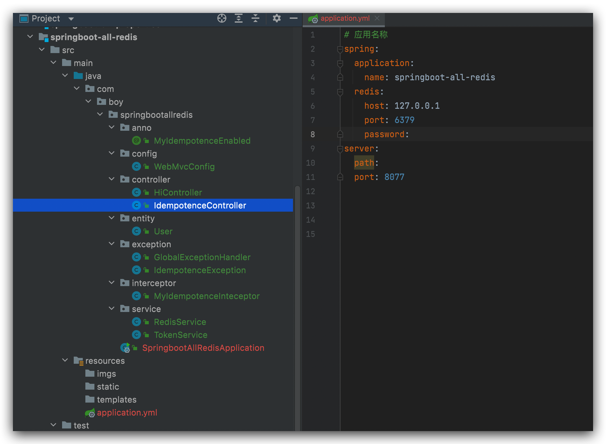
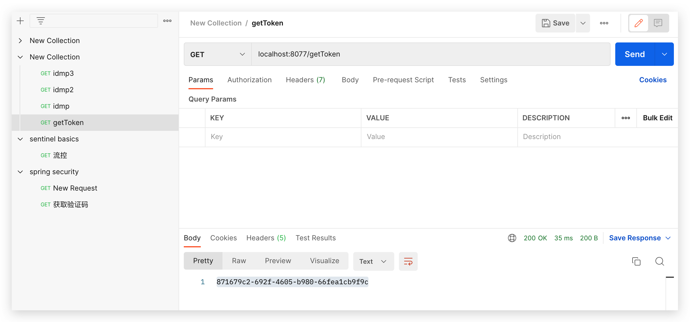
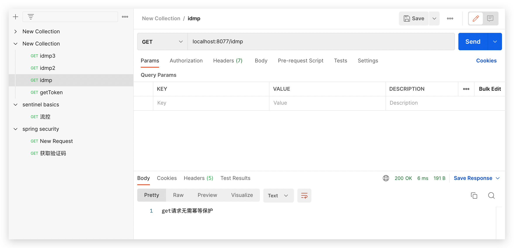
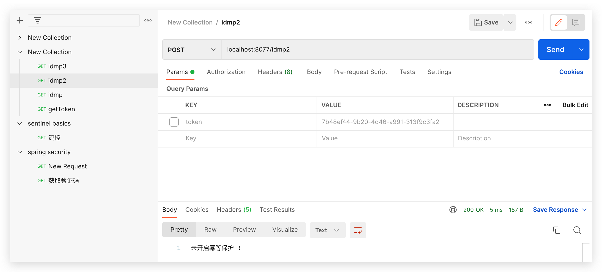
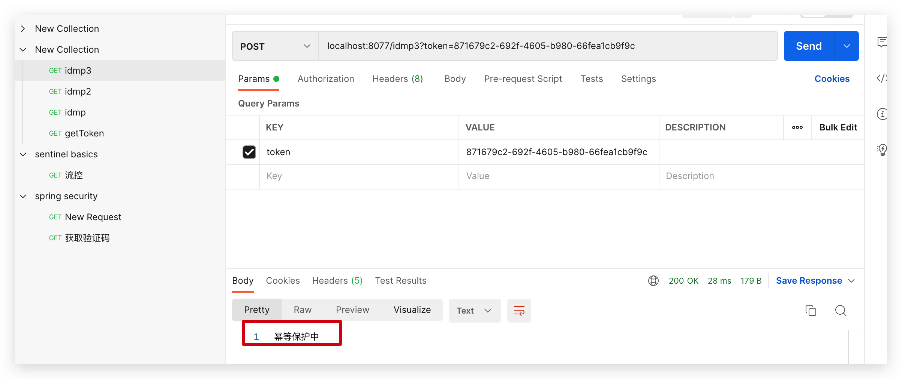
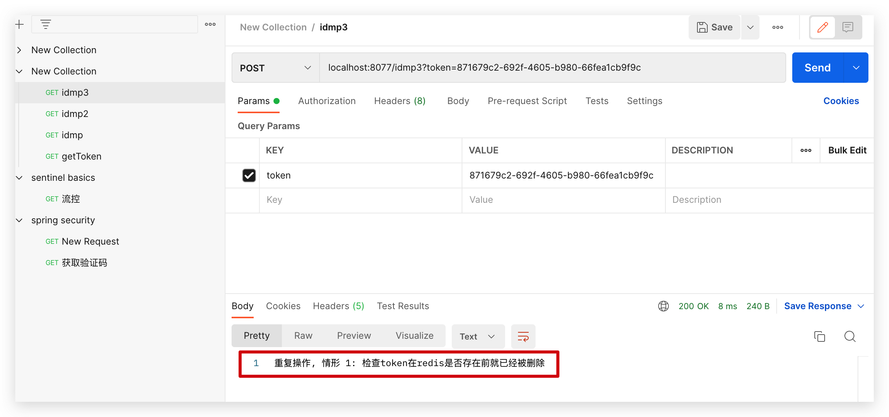

# 工程简介

## Redis解决接口幂等性问题
 
### 幂等性解释
对于幂等性问题, 出现的场景: 对于同一个接口请求, 使用相同的参数请求多次, 后台应该只接受并处理一次, 后续请求都应该视作重复请求而忽略, 同时还可以反馈给调用方一个提示信息表示接口请求重复了.
### 前提准备
### 解决方案1 token+redis+注解+拦截器

#### Step 1

首先封装redisService, 其中主要提供了三个方法:
1. 设置k-v, 并设置有效期
2. 删除key
3. 判断是否存在key
```java
package com.boy.springbootallredis.service;

import org.springframework.beans.factory.annotation.Autowired;
import org.springframework.data.redis.core.StringRedisTemplate;
import org.springframework.data.redis.core.ValueOperations;
import org.springframework.stereotype.Service;

import java.time.Duration;

/**
 * @author Joshua.H.Brooks
 * @description
 * @date 2022-09-05 15:31
 */
@Service
public class RedisService {
    @Autowired
    StringRedisTemplate stringRedisTemplate;

    /**
     * 设置k-v并指定有效期。
     *
     * @param key               键
     * @param val               值
     * @param expDurationSecond 有效期 单位秒
     * @return 成功赋值键值对， 并设置有效期， 则返回TRUE， 否则false。
     */
    public boolean setEx(String key, String val, Long expDurationSecond) {
        boolean flag = false;
        try {
            ValueOperations<String, String> ops = stringRedisTemplate.opsForValue();
            ops.set(key, val);
            stringRedisTemplate.expire(key, Duration.ofSeconds(expDurationSecond)); //设置半小时有效
            flag = true;
        } catch (Exception e) {
            e.printStackTrace();
        }
        return flag;
    }

    /**
     * 判断redis中是否存在某个键值对
     *
     * @param key
     * @return 根绝key是否查询到对应值， 有结果则为true， 否则false。
     */
    public boolean exists(String key) {
        return stringRedisTemplate.hasKey(key);
    }

    /**
     * 根据key删除键值对， 如果没有该key， 返回false。
     *
     * @param key
     * @return
     */
    public boolean remove(String key) {
        if (exists(key)) {
            System.out.println("...........removing.......... key = " + key);
            return stringRedisTemplate.delete(key);
        }
        return false;
    }
}
```

#### Step 2

其次封装TokenService, 其中主要有两个方法:
1. 生成Token, 并设置其有效期
2. 校验token是否存在于redis中, 存在说明其有效, 并且此时请求接口还不会诱发幂等性问题, 因为是第一次访问.
```java
package com.boy.springbootallredis.service;

import com.boy.springbootallredis.exception.IdempotenceException;
import org.springframework.beans.factory.annotation.Autowired;
import org.springframework.stereotype.Service;
import org.springframework.util.StringUtils;

import javax.servlet.http.HttpServletRequest;
import java.util.UUID;

/**
 * @author Joshua.H.Brooks
 * @description
 * @date 2022-09-05 15:39
 */
@Service
public class TokenService {
    @Autowired
    RedisService redisService;

    /**
     * 获取一个token，并将其存入redis。 具体生成的token没有限制。 暂时选择用UUID。
     *
     * @return 盛昌的token。
     */
    public String getInstanceAndSetExpire(Long expDurationSecond) {
        String s = UUID.randomUUID().toString();
        boolean b = redisService.setEx(s, s, expDurationSecond);
        return s;
    }

    /**
     * @param request
     * @return 返回token是否存在于redis中， true表明存在，对应第一次请求， false表明不存在， 对应幂等性问题的第2+次请求。
     * @throws IdempotenceException
     */
    public boolean checkToken(HttpServletRequest request) throws IdempotenceException {
        String token = request.getHeader("token");

        if (StringUtils.isEmpty(token)) {
            token = request.getParameter("token");
            if (StringUtils.isEmpty(token)) {
                throw new IdempotenceException("入参数token不存在");
            }
        }
        if (!redisService.exists(token)) {
            throw new IdempotenceException("重复操作, 情形 1: 检查token在redis是否存在前就已经被删除");
        }
        // 逻辑是， 请求幂等性保护的接口时， 都会在拦截器里调用检测token信息， 如果不存在就是上面的逻辑
        // 走到这里说明存在， 那么接口就会在此次请求时删除token，并执行后续的逻辑。 后续再请求时就不会再查到该token。
        // 从而起到保护作用。
        boolean removed = redisService.remove(token);
        if (!removed) {
            throw new IdempotenceException("重复操作, 情形 2: 检查到token在redis存在后,尝试删除该token, 并执行后续业务逻辑时, 发现token被删除");
        }
        return true;
    }
}
```

### Step 3 
第三步主要是做一些辅助工作. 
建一个注解, 作为开启幂等性保护的开关.
```java
package com.boy.springbootallredis.anno;

import java.lang.annotation.ElementType;
import java.lang.annotation.Retention;
import java.lang.annotation.RetentionPolicy;
import java.lang.annotation.Target;

/**
 * @author Joshua.H.Brooks
 * @description 建立注解， 被此注解修饰的方法即开启了幂等性保护
 * @date 2022-09-05 15:29
 */
@Target(ElementType.METHOD)
@Retention(RetentionPolicy.RUNTIME)
public @interface MyIdempotenceEnabled {
}
```
建幂等性异常类:
```java
package com.boy.springbootallredis.exception;

/**
 * @author Joshua.H.Brooks
 * @description 幂等性相关的异常
 * @date 2022-09-05 15:45
 */
public class IdempotenceException extends Exception {
    public IdempotenceException(String msg) {
        super(msg);
    }
}
```
建全局异常处理类, 对抛出的幂等性异常做最终处理.
```java
package com.boy.springbootallredis.exception;

import org.springframework.web.bind.annotation.ExceptionHandler;
import org.springframework.web.bind.annotation.RestControllerAdvice;

/**
 * @author Joshua.H.Brooks
 * @description 全局异常处理
 * @date 2022-09-05 16:10
 */
@RestControllerAdvice
public class GlobalExceptionHandler {
    @ExceptionHandler(IdempotenceException.class)
    public String handleIdempotenceException(IdempotenceException e){
        return e.getLocalizedMessage();
    }
}
```
#### Step 4

建立拦截器, 所有的请求都会走次拦截器, 如果监测到方法被注解@MyIdempotenceEnabled修饰,说明开启了幂等性保护, 就走token校验逻辑. 
```java
package com.boy.springbootallredis.interceptor;

import com.boy.springbootallredis.anno.MyIdempotenceEnabled;
import com.boy.springbootallredis.service.TokenService;
import org.springframework.beans.factory.annotation.Autowired;
import org.springframework.stereotype.Component;
import org.springframework.web.method.HandlerMethod;
import org.springframework.web.servlet.HandlerInterceptor;

import javax.servlet.http.HttpServletRequest;
import javax.servlet.http.HttpServletResponse;
import java.lang.reflect.Method;

/**
 * @author Joshua.H.Brooks
 * @description 幂等性问题的拦截器
 * @date 2022-09-05 15:55
 */
@Component
public class MyIdempotenceInteceptor implements HandlerInterceptor {
    @Autowired
    TokenService tokenService;

    /**
     * @param request
     * @param response
     * @param handler
     * @return true放行， false拦截
     * @throws Exception
     */
    @Override
    public boolean preHandle(HttpServletRequest request, HttpServletResponse response, Object handler) throws Exception {
        if (!(handler instanceof HandlerMethod)) {
            return true;
        }
        Method method = ((HandlerMethod) handler).getMethod();
        MyIdempotenceEnabled annotation = method.getAnnotation(MyIdempotenceEnabled.class);
        if (annotation != null) {
            try {
                return tokenService.checkToken(request); //开启幂等性保护的接口请求，校验token通过就放行。
            } catch (Exception e) {
                throw e;
            }
        }
        return true; //未开启幂等性保护的接口请求， 不会进入上面的校验， 直接放行。
    }
}
```

#### Step 5

并将其配置到MVC中
```java
package com.boy.springbootallredis.config;

import com.boy.springbootallredis.interceptor.MyIdempotenceInteceptor;
import org.springframework.beans.factory.annotation.Autowired;
import org.springframework.context.annotation.Configuration;
import org.springframework.web.servlet.config.annotation.InterceptorRegistry;
import org.springframework.web.servlet.config.annotation.WebMvcConfigurer;

/**
 * @author Joshua.H.Brooks
 * @description
 * @date 2022-09-05 16:02
 */
@Configuration
public class WebMvcConfig implements WebMvcConfigurer {
    @Autowired
    MyIdempotenceInteceptor myIdempotenceInteceptor;

    @Override
    public void addInterceptors(InterceptorRegistry registry) {
        registry.addInterceptor(myIdempotenceInteceptor).addPathPatterns("/**").excludePathPatterns("/login");
    }
}
```

#### Step 6
提供controller层方法供测试.
```java
package com.boy.springbootallredis.controller;

import com.boy.springbootallredis.anno.MyIdempotenceEnabled;
import com.boy.springbootallredis.service.TokenService;
import org.springframework.beans.factory.annotation.Autowired;
import org.springframework.util.StringUtils;
import org.springframework.web.bind.annotation.GetMapping;
import org.springframework.web.bind.annotation.PostMapping;
import org.springframework.web.bind.annotation.RequestParam;
import org.springframework.web.bind.annotation.RestController;

/**
 * @author Joshua.H.Brooks
 * @description
 * @date 2022-09-05 16:06
 */
@RestController
public class IdempotenceController {
    @Autowired
    TokenService tokenService;

    /**
     * 获取token， 并设置有效期，单位秒， 没设置时默认为半小时。
     * @param expDurationSecond
     * @return
     */
    @GetMapping("/getToken")
    public String getToken(@RequestParam(required = false) Long expDurationSecond){
        if(StringUtils.isEmpty(expDurationSecond)){
            expDurationSecond = 1800L;
        }
        return tokenService.getInstanceAndSetExpire(expDurationSecond);
    }

    /**
     * 无需开启
     * @return
     */
    @GetMapping("/idmp")
    public String idmp(){
        return "get请求无需幂等保护";
    }

    /**
     * 未开启
     * @return
     */
    @PostMapping("/idmp2")
    public String idmp2(){
        return "未开启幂等保护 !";
    }

    /**
     * 已开启
     * @return
     */
    @PostMapping("/idmp3")
    @MyIdempotenceEnabled
    public String idmp3(){
        return "幂等保护中";
    }
}
```

#### Step 7
至此, 最终项目中的文件及目录层级如图:


测试.





