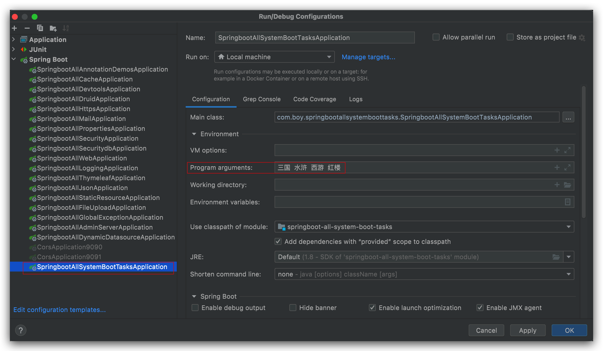
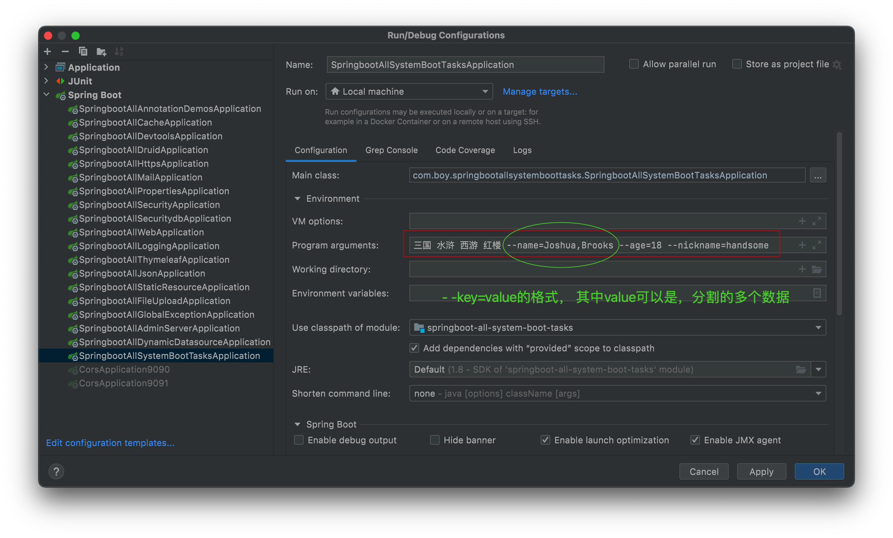

# 本章节介绍 Spring Boot项目系统启动任务的方式.
## 新建项目&pom 

## yml

## CommandLineRunner
### 代码
新建类, 实现CommandLineRunner接口实现其方法即可在其中完成系统启动任务的功能.
```java
package com.boy.springbootallsystemboottasks;

import org.springframework.boot.CommandLineRunner;
import org.springframework.core.annotation.Order;
import org.springframework.stereotype.Component;

import java.util.Arrays;

/**
 * @author Joshua.H.Brooks
 * @description
 * @date 2022-09-04 10:32
 */
@Component
@Order(1) // 数值越小优先级越高， 默认取值是Ordered.LOWEST_PRECEDENCE， 即 最小优先级
public class MyCommandLineRunner01 implements CommandLineRunner {
    @Override
    public void run(String... args) throws Exception { //该args就是main函数传过来的参数
        System.out.println("########         CommandLineRunner-01       ########");
        System.out.println("args = " + Arrays.toString(args));
    }
}
```
### 设置启动参数
!
### 测试
[测试](src/main/resources/imgs/2.png)

## ApplicationRunner
用法和CommandLineRunner类似, 只是接口变成了ApplicationRunner, 并且可用指定参数的方式更丰富些.
### 代码

### 设置启动参数


### 测试
[测试](src/main/resources/imgs/4.png)


注意⚠️: 除了用Idea工具指定程序入口参数外, 可也可以启动jar包时指定.
**`java -jar springboot-all-system-boot-tasks-0.0.1-SNAPSHOT.jar 三国 水浒 --name=刘,德华 --age=18 `**
