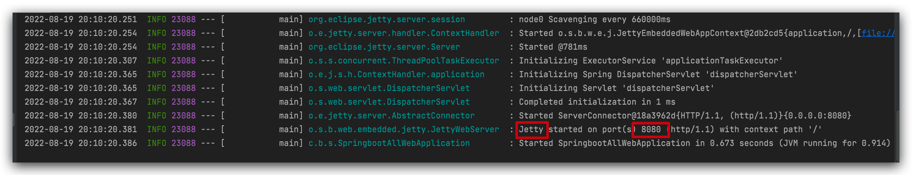

# SpringBoot基础配置
/Users/JoshuaBrooks/IdeaProjects/official/springboot-all/springboot-all-web/
## Web容器配置

新建springboot项目后可能最常见的就是要配置一下web容器, 常见的tomcat配置, 观察pom依赖引入的jar包中已经有tomcat了,

所以直接在application.properties中配置相关属性即可:

```properties
server.port=8081 # 如果想使用随机端口， 此处设置为0 即可。 
server.servlet.context-path=/lee

server.tomcat.accesslog.prefix=access_log
```

配置完新建一个测试类并启动项目,启动日志如下:

 

测试类:

```java
package com.boy.springbootallweb.controller;

import org.springframework.web.bind.annotation.GetMapping;
import org.springframework.web.bind.annotation.RestController;

/**
 * @author Joshua.H.Brooks
 * @description
 * @date 2022-08-19 20:21
 */
@RestController
public class HiController {

    @GetMapping("/hi")
    public String hi(){
        return "Hi";
    }
}
```

然后前端访问测试访问:


前端访问的同时后台输出:

```markdown
**注意: 上面的配置中, 只有前两行是容器类别无关的,第三行设置的tomcat访问日之前缀才是类别相关的,  因为常见的web容器除了tomcat, 还有jetty,underdow等.如果不想使用springboot内置的tomcat作为容器, 需要再pom文件中先配除掉然后引入新的容器依赖. **
```
如下:
替换pom依赖

重启:


另外: 如果想使用随机端口启动项目 进行如下操作即可
1. 修改server.port = 0
2. 添加监听器类实现ApplicationListener<WebServerInitializedEvent>接口
   在继承方法中获取端口， （注意添加@Component注解将该类注册到spring容器）
3. 启动项目发现日志中输出随机的端口。


server相关的配置:

日志输出:
```text
192.168.10.107 25009 25009 HTTP/1.1 GET 8081  "GET /lee/getUsers HTTP/1.1" 200 - [19/Aug/2022:22:14:40 +0800] - /lee/getUsers localhost 54??? ???0.054 http-nio-8081-exec-1 "-" "Mozilla/5.0 (Macintosh; Intel Mac OS X 10_15_7) AppleWebKit/537.36 (KHTML, like Gecko) Chrome/104.0.0.0 Safari/537.36"
```

yml里日志格式的说明:
```properties
%a - Remote IP address
%A - Local IP address
%b - Bytes sent, excluding HTTP headers, or '-' if no bytes were sent
%B - Bytes sent, excluding HTTP headers
%h - Remote host name
%H - Request protocol
%l - Remote logical username from identd (always returns '-')
%m - Request method
%p - Local port
%q - Query string (prepended with a '?' if it exists, otherwise an empty string
%r - First line of the request
%s - HTTP status code of the response
%S - User session ID
%t - Date and time, in Common Log Format format
%u - Remote user that was authenticated
%U - Requested URL path
%v - Local server name
%D - Time taken to process the request, in millis
%T - Time taken to process the request, in seconds
%I - current Request thread name (can compare later with stacktraces)
```
具体可以参考[AccessLogValve官方说明](http://www.docjar.org/docs/api/org/apache/catalina/valves/AccessLogValve.html)

## 属性注入

项目中可能会有这样的需求, 在application.properties中定义了变量值后, 想要绑定到对应的对象属性, 也就是属性注入.

例如在application.properties中:

```properties
book.id=1
book.name=三国演义
book.price=99
```

注入到Book类, 需要用 @Value注解,按如下格式注入:

```java
package com.lee.chapter1.pojo;

import org.springframework.beans.factory.annotation.Value;
import org.springframework.stereotype.Component;

@Component
public class Book {
    @Override
    public String toString() {
        return "Book{" +
                "id=" + id +
                ", name='" + name + '\'' +
                ", price=" + price +
                '}';
    }

    public Integer getId() {
        return id;
    }

    public void setId(Integer id) {
        this.id = id;
    }

    public String getName() {
        return name;
    }

    public void setName(String name) {
        this.name = name;
    }

    public Double getPrice() {
        return price;
    }

    public void setPrice(Double price) {
        this.price = price;
    }
    @Value("${book.id}")
    private Integer id;
    @Value("${book.name}")
    private String name;
    @Value("${book.price}")
    private Double price;
}

```

在测试类中注入Book.

```java
package com.lee.chapter1;

import com.lee.chapter1.pojo.Book;
import org.junit.jupiter.api.Test;
import org.springframework.beans.factory.annotation.Autowired;
import org.springframework.boot.test.context.SpringBootTest;

@SpringBootTest
public class Chapter1ApplicationTests {

    @Autowired
    Book book;
    @Test
    public void contextLoads() {
        System.out.println(book.toString());
    }

}

```

然后启动测试类可以看到打印出book属性值, 但是乱码, 需要设置file encodin后重新保存即可.


重新启动可以看到测试结果如下:


## 安全的属性注入

但是如果有很多变量都像这样需要注入到某对象的属性中, 如果都使用@Value挨个设置就会很臃肿, 也不便于维护. 一种更简单的注入方式就是使用@ConfigurationProperties注解注入:

```properties

```


```java
@ConfigurationProperties(prefix = "book.mine")
public class Book {
    //@Value("${book.id}")
    private Integer id;
    //@Value("${book.name}")
    private String name;
    //@Value("${book.price}")
    private Double price;
  ...
}
```

可以看到`application.properties`文件中的变量:

```properties
book.mine.id=2
book.mine.name=西游记
book.mine.price=100
```

都成功注入到了属性中, 如下:


## Notes

还有一种配置方式: 将变量单独放到一个独立的`book.properties`文件中, 为了让项目启动时扫描时, 能将该文件中的信息扫描处理, 需要搭配注解使用, 方式如下:

首先配置`book.properties`

```properties
books.id=3
books.name=红楼梦
books.price=88
```

然后在bean Book上使用@PropertySource注解, 注意该注解要和@ConfigurationProperties注解一起使用, 否则不会注入.

```java
@ConfigurationProperties(prefix = "books")
@PropertySource(value = "classpath:book.properties")
public class Book {
    //@Value("${book.id}")
    private Integer id;
    //@Value("${book.name}")
    private String name;
    //@Value("${book.price}")
    private Double price;
  ...
}
```

@ConfigurationProperties(prefix = "books")

如果`application.properties`和`book.properties`都有books前缀开头的属性, 那么`application.properties`优先级高, 最终是`application.properties`里的值注入生效.